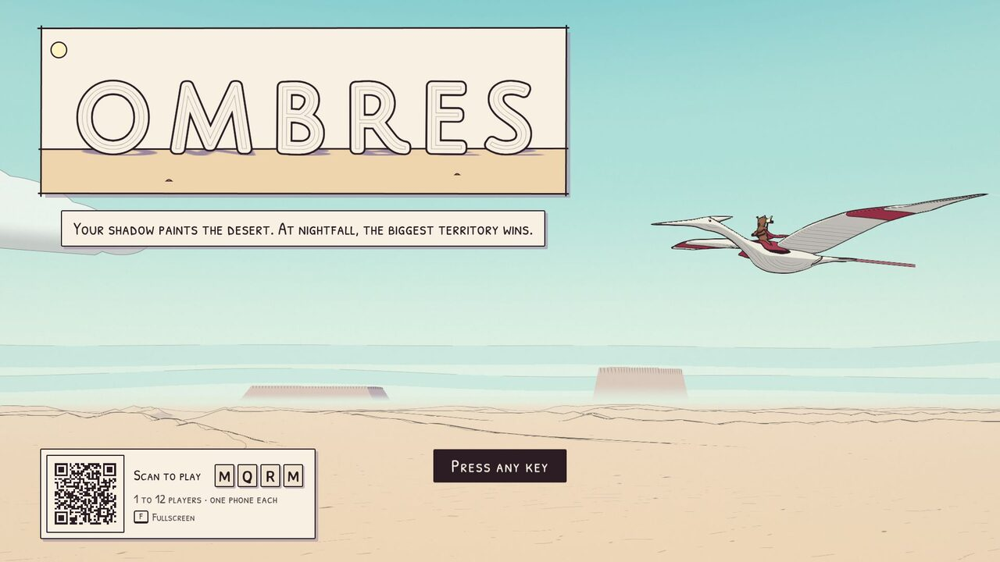
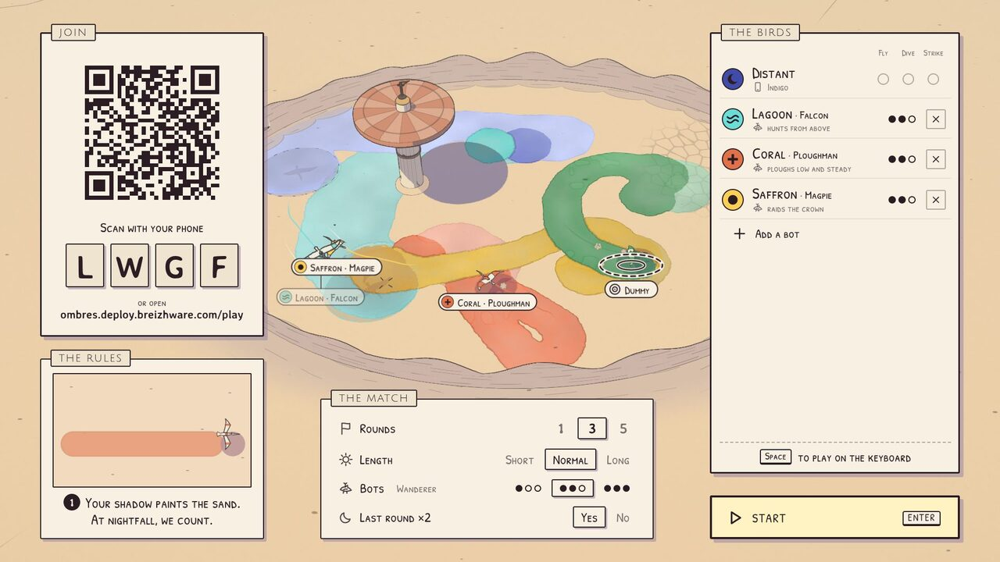
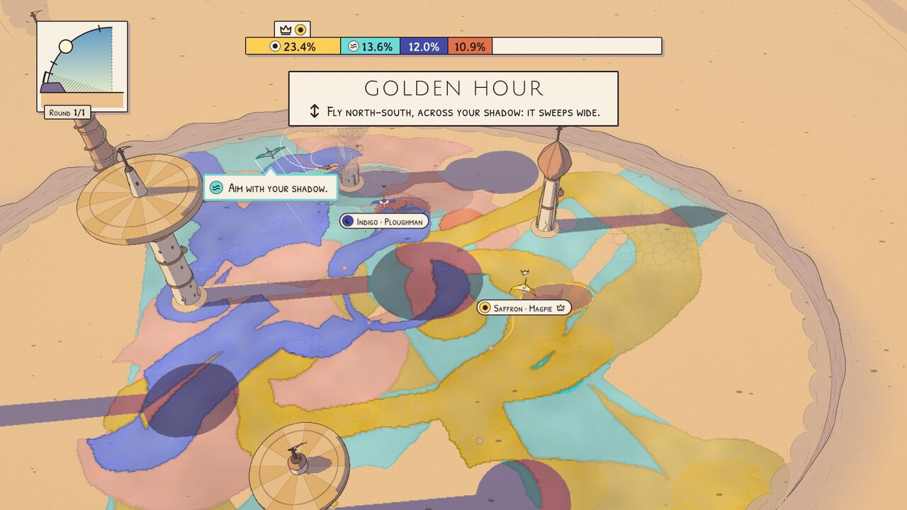
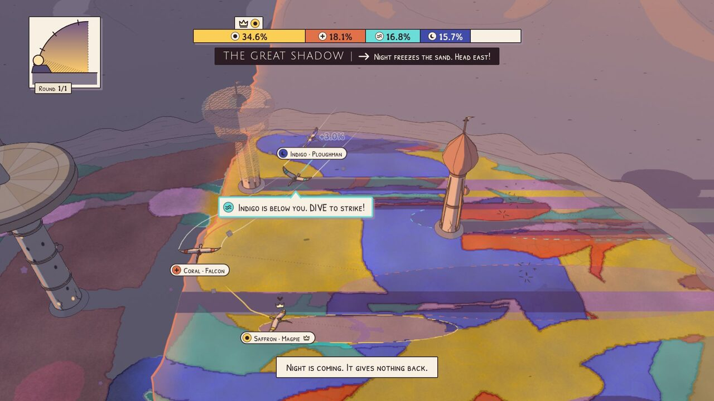
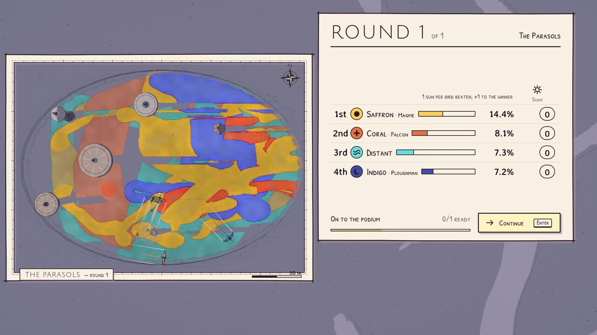
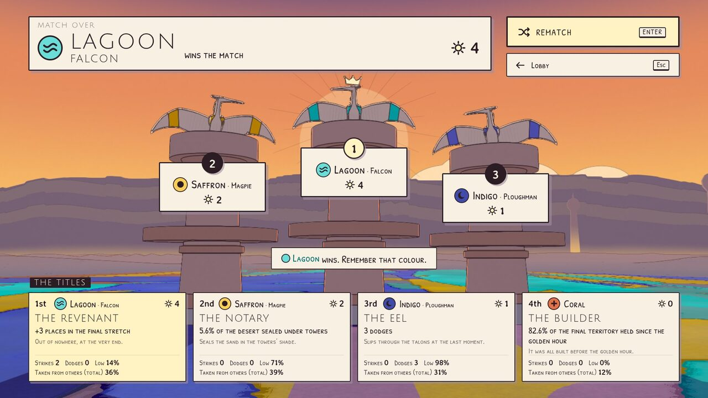
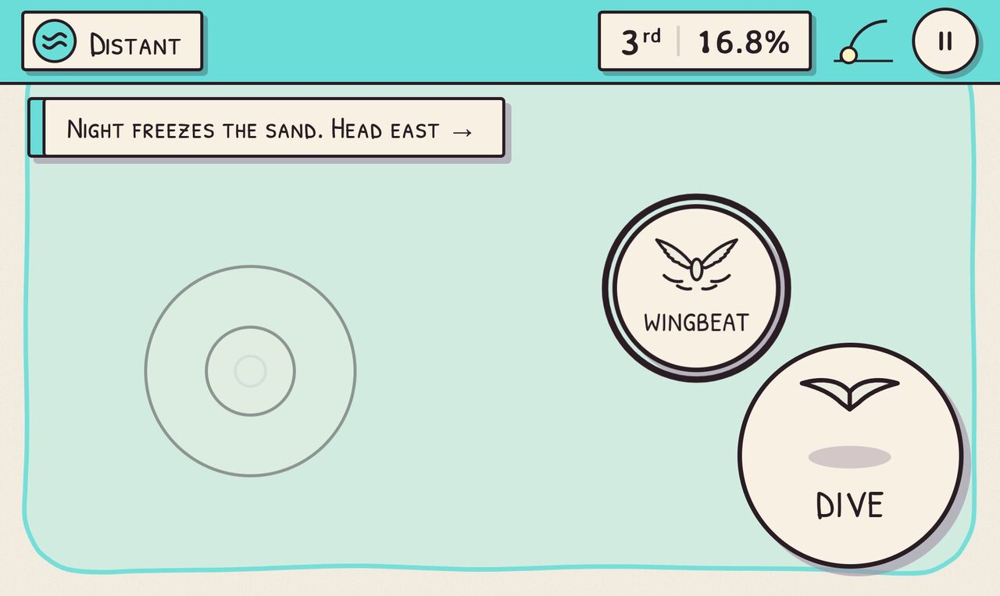

# Ombres

*Version française : [README.fr.md](README.fr.md)*

> **Your shadow paints the desert. At nightfall, the biggest territory wins.**

*Ombres* (French for "shadows") is a local multiplayer party game for 1 to 12 players, at its best with 2 to 6. It runs in the browser of a computer plugged into a screen. Each player scans a QR code and uses their phone to steer a giant bird over a desert dotted with towers. Your bird's shadow paints the sand in your colour. As the round goes on, the sun sets: shadows stretch until they sweep huge areas in a few seconds, then night comes down from the cliff and freezes everything. The look is inspired by the *ligne claire* of Moebius: ink outlines, flat colour, watercolour washes, a pastel desert.

**Play now: https://ombres.deploy.breizhware.com**
Open it on a computer, preferably in Chrome, Edge or Firefox; phones scan the QR code shown in the lobby. One phone is enough, since bots fill the empty seats.

The game was designed and built by Claude Opus 5.5 (Anthropic) from a single brief, under the supervision of Brieuc Crosson. No human wrote any of its code. [How it was made](#how-it-was-made) describes the process and lists every human intervention.

| | |
|---|---|
| <br>*Title screen* | <br>*Lobby: scan, pick a colour, practise on the sand* |
| <br>*Golden hour: tower shadows stripe the territory* | <br>*The Great Shadow: night freezes the desert, west to east* |
| <br>*Round results on the map* | <br>*Podium and titles* |


*The phone controller*

---

## How to play

Open the game on the computer and press any key. The lobby shows a QR code and a four-letter room code. Each player scans the QR code (or opens the address shown and types the code), then picks a name and a colour. Their bird takes off at once over the lobby's desert, where three small goals (Fly, Dive, Strike) teach the controls.

Playing alone takes a single phone: bots fill the match. You can also join from the computer's keyboard by pressing Space in the lobby, and a second keyboard player joins with AltGr. The first player starts the match from their phone, or with Enter on the computer. A match is three rounds of about two minutes each, and the last round counts double. Then come the podium, the titles and a rematch vote.

### The five rules (all shown on screen)

1. **Your shadow paints the sand in your colour.** At nightfall, whoever owns the most sand wins the round.
2. **Hold DIVE to skim the sand: small, strong shadow. Let go to climb: wide, pale shadow.** A pale shadow cannot repaint strong sand.
3. **DIVE above a lower bird to strike it.** On a hit, it stalls and its trail turns your colour. On a miss, you stall. When the *clack* sounds, the target can dodge with a WINGBEAT.
4. **Tower shadows freeze the sand.** A bird whose shadow disappears into one is hidden.
5. **The sun goes down.** Shadows stretch; then, for the last 12 seconds (the Great Shadow), night comes down from the cliff and freezes everything, west to east.

### Controls

| | Phone | Keyboard, player 1 | Keyboard, player 2 | Gamepad |
|---|---|---|---|---|
| Steer | joystick (left half of the screen), tilt, or relative steering | WASD (ZQSD on AZERTY) or arrow keys | IJKL | left stick |
| DIVE (hold) | big button | Space | AltGr | A / right trigger |
| WINGBEAT | small button | Left Shift | `;` (M on AZERTY) | B / RB |
| Pause | long press on ⏸ | Esc | | Start |

`F` toggles fullscreen. Settings on the computer: separate volumes, graphics quality, fullscreen, French or English, colour-blind mode (a pattern and a glyph for each player), narrator (voice, text or off), tips, reduced flashes, screen shake. On the phone: control scheme (absolute, relative or tilt), flight assist, vibration.

---

## What's in the game

- A loading screen with real progress, and an animated title screen: a cinematic cut from a real round played by bots.
- A lobby with the QR code, room code, player slots (name, colour, glyph), bots to add or remove (seven personalities, from Falcon to Watchmaker, at three levels, from Fledgling to Sand Lord), match settings, a playable desert with the three warm-up goals, and animated rule cards.
- Four maps (The Parasols, The Needles, The Giants, The Sundial), with an arena that grows with the number of birds.
- A complete phone controller: joining, profile, lobby, controller, between-round screens, end of match and rematch, automatic reconnection, screen kept awake, vibration.
- A player who disconnects is replaced by a bot (same colour, same territory) that hands control back when they return. Refreshing the computer does not break the match: same room, same screen, same round.
- A HUD readable from across the room: a sundial as the only clock, a sorted territory bar with a crown for the leader, markers for off-screen players, name labels, phase banners, narrator subtitles, contextual tips.
- Game feel: hit slow-motion, screen shake, trails, sand puffs, impact stars, feathers, a comic-panel flash, and a camera that frames the birds and their shadows and plays up strikes and the Great Shadow.
- A narrator with 722 pre-generated clips (361 lines in each language; French with Qwen3-TTS on Kaggle GPUs, English with Pocket TTS run locally). It names players by their colour, speaks rarely and picks its moments; subtitles are always available.
- Generative music that follows the sun's course, a track for each screen, wind ambience, and a sound for every action and every interface element.
- Podium, end-of-match titles (awarded by z-score), stats, rematch; pause; credits.

---

## How it was made

*Ombres* was designed and built by Claude Opus 5.5 (Anthropic), under the supervision of Brieuc Crosson. It started from a single brief, kept verbatim in [docs/BRIEF.md](docs/BRIEF.md): a local party game, giant birds whose shadows paint a desert, a setting sun, a Moebius-inspired look, and the instruction not to stop before the game was complete, polished and deployed.

The work took about 35 hours of autonomous agent time, orchestrated as multi-agent workflows in Claude Code. The git history runs from the first commit on 25 September 2026 to the final deployment on 27 September.

1. Research ([docs/research/](docs/research/)). Five parallel tracks: Moebius's style studied on 23 reference images, real-time non-photorealistic rendering with a measured prototype, free assets and their licences, local text-to-speech, and the stack and deployment, tested for real. Then three game designers worked independently (party, depth and spectacle angles) and a design director chose between their proposals.
2. Design. [docs/GDD.md](docs/GDD.md) sets the rules and every number, checked by simulation. [docs/ART_BIBLE.md](docs/ART_BIBLE.md) sets the image: palettes, the 12 player colours, the rendering pipeline. [docs/ARCHITECTURE.md](docs/ARCHITECTURE.md) sets the modules, the typed contracts between them, and which agent owns which folder.
3. Modules in parallel. Eight agents, one per area: simulation, bots, world rendering, birds and effects, network and phone app, audio, narrator, computer UI. Each wrote only in its own folders and filed requests in [docs/agent-notes/](docs/agent-notes/) when it needed a change elsewhere.
4. Integration and first deployment: game loop, input, camera, loading, persistence, end-to-end tests with emulated phones.
5. Three polish waves ([docs/polish/](docs/polish/)). Independent critics (art direction, game feel, first-time player, technical, audio) played the game and reported. Their findings became work orders split by file ownership, fixed in parallel, then checked on screenshots and for regressions.
6. Final deployment to a NixOS virtual machine through the Magic Deploy MCP server.

The decisions that shaped the game are logged in [DECISIONS.md](DECISIONS.md), with their reasons. The rendering was judged on screenshots that the agents took in headless Chrome and then looked at; the balance, on thousands of rounds played by bots.

No line of code in this repository was written by a human, but the project is not human-free. Brieuc Crosson wrote the brief that defines the concept, the core mechanic, the art direction and the requirements; supervised the work and made the calls listed below; and built the infrastructure it runs on: Magic Deploy, the NixOS hosting platform used here (including the custom-hostname feature added during the project), and the development environment.

The complete list of human interventions:

- writing the brief;
- during development, one message: suggesting a better text-to-speech model through the Gemini API or Kaggle GPUs (the French voice was then regenerated with Qwen3-TTS on Kaggle; no Gemini key was available), warning that disk space was running low, and asking for "under the supervision of Brieuc Crosson" to be added to the credits;
- once the game was deployed: asking for this GitHub repository (with `master` as the branch name, the maintainer's convention), asking whether the missing anti-aliasing was intentional (which led to a fix), and adding custom hostnames to Magic Deploy so the game could have a clean URL;
- preparing the public release: link previews, a landing page for phone visitors (with an "open the game here anyway" button, so a phone or tablet can be the screen), a trailer, this English README, and a non-commercial licence.

No image-generation model was used. Everything on screen is code: shaders, procedural meshes for the birds, riders and towers, a generated sky and ground, interface glyphs drawn in code. The only visual files from outside are three OFL fonts. Sound effects and music are CC0 and CC-BY files from Freesound, Kenney and OpenGameArt, credited file by file, or are synthesized in code (a wind layer, the strike's *clack*); the music during rounds is composed live from CC0 instrument samples. The narrator's voices are the only synthesized media: they come from open-weight text-to-speech models, credited below, reading lines written by Claude.

---

## Development

Environment: NixOS (a flake is provided) or Node 22 with pnpm 10.

```bash
nix develop          # Node 22, pnpm, ffmpeg, sox, imagemagick (same Node as the production VM)
pnpm install
pnpm dev             # http://localhost:8787: server + Vite (HMR) on a single port
```

Open `http://localhost:8787` on the computer. Phones on the same network scan the QR code, which points to the computer's local IP. Over plain HTTP, iOS tilt controls and the Wake Lock are unavailable (both require HTTPS); the deployed version has them.

| Command | What it does |
|---|---|
| `pnpm typecheck` | strict TypeScript (TS 7) |
| `pnpm test` | 362 unit tests (vitest): simulation, bots, rendering, camera, UI, input, network, phone, audio, narrator |
| `pnpm check:boundaries` | checks that the simulation and bots import neither React, three.js nor the DOM, and that the phone app does not import three.js |
| `npx tsx tools/sim-run.ts` | full headless rounds, with the balance metrics of GDD §18 |
| `npx tsx tools/bots-arena.ts` | bot matches in bulk, to balance personalities and levels |
| `node tools/e2e/solo.mjs`, `phones.mjs`, `resilience.mjs`, `flows.mjs` | end-to-end matches (Playwright + Chrome, emulated phones) against a dev server started with `PORT=8811 pnpm dev` |
| `node tools/shot.mjs <url> <out.jpg>` | WebGL screenshot (headless Chrome, GPU) |

The Playwright scripts use the Chrome binary given by `CHROME_PATH`; `nix develop .#full` provides Chromium (and Python, to regenerate the voices).

Dev pages (with `pnpm dev` only): `/dev/world.html`, `/dev/birds.html`, `/dev/camera.html`, `/dev/ui.html`, `/dev/audio.html`, `/dev/narrator.html`, `/dev/phone.html`, `/dev/sim.html`, `/dev/bots.html`. In-game test options sit behind `?debug` (`?debug=fast`, `?debug=perf`…); without it, nothing debug-related is visible.

### Architecture at a glance

Stack: strict TypeScript, React 19, three.js 0.186 with React Three Fiber 9 and postprocessing, zustand, Vite 8; a Node 22 server with `ws`; native WebAudio.

- [`server/`](server/): WebSocket relay (rooms, reconnection) and static files. No game logic: the computer is authoritative.
- [`src/sim/`](src/sim/): pure, deterministic simulation at 30 Hz (sun, analytic shadows, painting, strikes, towers, Great Shadow, match, titles). Contract in `src/sim/types.ts`; every tuning constant in `src/sim/rules.ts`.
- [`src/bots/`](src/bots/): pure AI that goes through the same input (`BirdInput`) as humans.
- [`src/input/`](src/input/): the single input layer (phone, keyboard, gamepad, bot).
- [`src/host/`](src/host/): the game on the computer: `runner/` (orchestration), `render/` (React Three Fiber and the NPR pipeline: a ground-space height shadow map, an MRT geometry pass, ink as a post-process), `camera/`, `ui/`, `audio/`.
- [`src/director/`](src/director/): narrator and tips (pure logic).
- [`src/net/`](src/net/), [`src/phone/`](src/phone/): network session and the phone controller app (no three.js: about 115 kB of gzipped JS).

Details (in French): [docs/ARCHITECTURE.md](docs/ARCHITECTURE.md).

---

## Deployment (Magic Deploy)

The public instance runs on Magic Deploy, a host that runs a NixOS configuration in a virtual machine behind an HTTPS proxy, driven through an MCP server. The VM ([deploy/configuration.nix](deploy/configuration.nix)) runs a single Node service on port 80. The proxy caps each request at about 1 MiB while the game weighs about 25 MB, so the VM only receives its configuration and the server bundle. The site is then uploaded into a persistent volume through an authenticated endpoint (secret `UPLOAD_TOKEN`, never committed), in SHA-256-checked chunks, with an atomic switch.

```bash
pnpm deploy:prepare                                   # build + deploy/server.mjs + token in .secrets/
# First time: deploy deploy/ with the magic-deploy MCP (hostname "ombres", volume /var/lib/ombres,
#             secret UPLOAD_TOKEN = .secrets/upload-token); afterwards, redeploy only when the server changes
node tools/deploy-upload.mjs https://ombres.deploy.breizhware.com        # sends only the files that changed
node tools/e2e/deploy/remote-smoke.mjs https://ombres.deploy.breizhware.com   # computer + emulated phone
node tools/e2e/deploy/remote-round.mjs https://ombres.deploy.breizhware.com   # one full round online
```

To host it elsewhere, `pnpm build && PORT=8080 pnpm start` serves the game and the relay from a single Node 22 process (one esbuild bundle, no node_modules). Phones must be able to reach the same machine; `PUBLIC_URL` sets the address encoded in the QR code. Tilt on iOS and the Wake Lock need HTTPS.

---

## Documentation

The design documents are written in French: [DECISIONS.md](DECISIONS.md), [docs/GDD.md](docs/GDD.md), [docs/ART_BIBLE.md](docs/ART_BIBLE.md), [docs/research/](docs/research/), and the rest of `docs/`. Code comments are in French too; identifiers are in English, and the game itself is in French and English.

| Document | Contents |
|---|---|
| [docs/BRIEF.md](docs/BRIEF.md) | the original brief, verbatim |
| [DECISIONS.md](DECISIONS.md) | decision log: what was settled, and why |
| [docs/GDD.md](docs/GDD.md) | the full game design, with every number, validated by simulation |
| [docs/ART_BIBLE.md](docs/ART_BIBLE.md) | art and rendering bible (palettes, 12 validated player colours, pipeline) |
| [docs/ARCHITECTURE.md](docs/ARCHITECTURE.md) | modules, contracts, conventions, file ownership |
| [docs/research/](docs/research/) | research: Moebius's style, real-time NPR, assets and licences, text-to-speech (local, then Kaggle GPUs), stack and deployment, three game design proposals, balance |
| [docs/agent-notes/](docs/agent-notes/) | notes from each module (API, decisions, limits) |
| [docs/polish/](docs/polish/) | critiques, work orders and verification reports from the three polish waves |
| [docs/CREDITS-sources.md](docs/CREDITS-sources.md), [assets-staging/LICENSES.md](assets-staging/LICENSES.md) | source and licence of every asset |

## Credits and licences

Code, text, art direction and game design: designed and built by Claude Opus 5.5 (Anthropic), under the supervision of Brieuc Crosson.
Music: Alexandr Zhelanov ("Futuristic ambient 1", CC BY 4.0), Tri-Tachyon ("Soundscape – Dust – Ambient Guitar", CC BY 4.0), cynicmusic and isaiah658 (CC0). Sound effects: Freesound contributors and Kenney (CC0). Narrator voices: in French, Qwen3-TTS by Alibaba (Apache 2.0), with a synthetic voice designed with Qwen3-TTS VoiceDesign (no real person cloned); in English, Pocket TTS by Kyutai (CC BY 4.0), with the preset voice of Bill Boerst (LibriVox, CC0). Fonts: Julius Sans One, Patrick Hand SC, Averia Sans Libre (SIL OFL 1.1). Birds, riders, towers, sky and ground are generated procedurally. The full list, file by file, is in [docs/CREDITS-sources.md](docs/CREDITS-sources.md) and on the in-game Credits screen.

### License

*Ombres* is **source-available under a non-commercial licence**: the [PolyForm Noncommercial License 1.0.0](LICENSE.md), © 2026 Brieuc Crosson. You are welcome to play it, read and study the code, modify it and share it, for any non-commercial purpose (personal use, teaching, research, hobby projects, non-profits). **Selling the game or using it commercially — including hosting it as a paid service or building it into a paid product — requires written permission**: open an issue or contact Brieuc Crosson through GitHub. Keep the `Required Notice` line of [LICENSE.md](LICENSE.md) in any copy.

This is not an OSI "open source" licence, by design: the goal is to keep the project free for everyone while preventing someone else from selling it.

Third-party assets keep their own licences, listed file by file in [docs/CREDITS-sources.md](docs/CREDITS-sources.md):

- music: CC BY 4.0 (attribution above) and CC0;
- sound effects: CC0;
- fonts: SIL Open Font License 1.1 (licence texts in [public/fonts/](public/fonts/));
- narrator voices: generated with Pocket TTS (weights under CC BY 4.0) and Qwen3-TTS (Apache 2.0).

## Known limitations

- Host computer: Chrome, Edge or Firefox (the audio is OGG). Phones: any recent mobile browser (iOS Safari, Chrome for Android).
- The agents tested the game in emulation (Playwright: iPhone 15 Pro, Pixel 7, keyboard, simulated gamepad) and on the deployed URL, not on physical phones. They cannot hear, either: sound and voice quality were validated by measurement (loudness, spectrum, automatic transcription).
- The balance comes from thousands of bot rounds, not yet from matches between humans.
