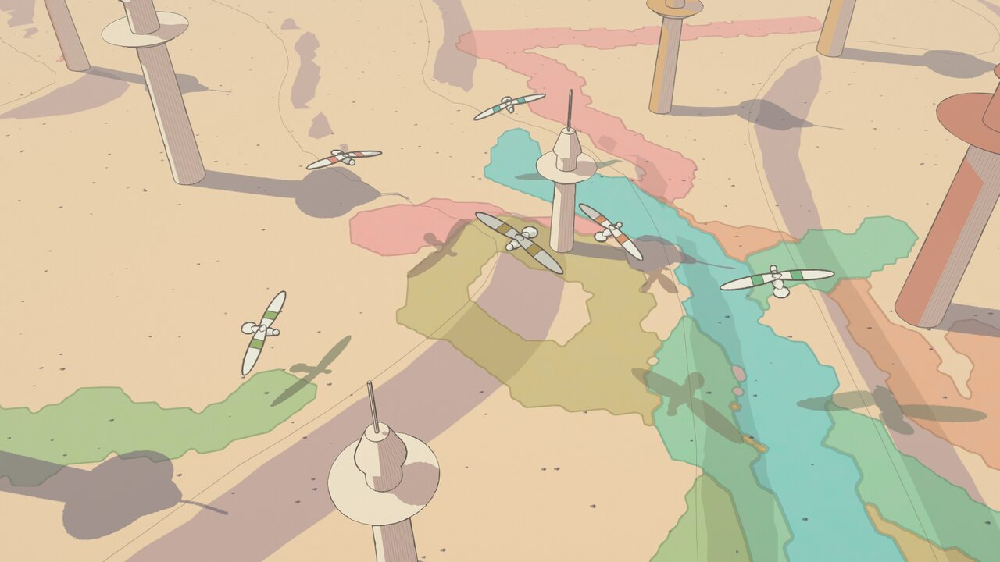
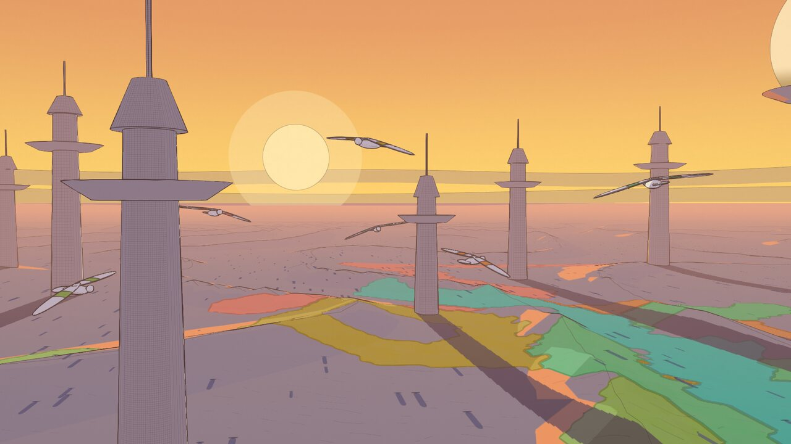

# Rendu non photoréaliste « ligne claire / Moebius » en temps réel : état de l'art et pipeline pour *Ombres*

> Stack visée : three.js r186 + React Three Fiber 9 + pmndrs `postprocessing` 6 (WebGL2).
> Compagnon de `moebius-style.md`, qui fixe **quoi** dessiner (règles R1 à R25, palettes). Ce document fixe **comment** le calculer, à quel coût et dans quel ordre.
> Tout ce qui est marqué **[validé]** a été prototypé, capturé et chronométré sur la machine de dev : Ryzen 5 4600H, iGPU Radeon Vega 6 (RENOIR), Chrome 150 / ANGLE-Vulkan, 1920×1080. Le prototype est dans `docs/research/npr-prototype/` et les captures dans `docs/research/img/npr/`.

---

## 0. TL;DR

1. **Une seule passe géométrique en MRT** : couleur (sRGB8) + normale de vue et ID d'objet (RGBA8) + profondeur (float). Pas de `NormalPass`, qui refait toute la géométrie et ignore les déformations de vertex. Coût de la 2ᵉ attache : ≈ 0 ms mesuré. **[validé]**
2. **Tout le « dessin » se fait dans les matériaux** : aplats 2 tons, ombres portées, lavis de territoire, hachures, pointillés, rides, crêtes, brume. Le **post-process se limite à une seule `Effect`** (contours encrés + papier + vignette ≤ 5 %), suivie de SMAA. Deux passes plein écran seulement : chaque passe 1080p coûte 0,35 ms en RGBA8, 1,2 ms en HalfFloat sur l'iGPU. **[validé]**
3. **Contours** : on prend la dérivée seconde de **1/z** (5 taps). Elle est **nulle sur tout plan**, donc aucun faux contour sur le sable en incidence rasante et aucun seuil à bricoler. On la combine avec les normales (pli > 40°) et l'ID d'objet ou de matériau (cape, bande d'aile). Le trait est posé du côté de l'objet le plus proche. Les lignes s'effacent avec la brume (méthode de Sable) et tremblent via un bruit **ancré dans le monde**. **[validé]**
4. **Ombres portées** : on utilise une **« height shadow map » en espace sol**. Les casters (oiseaux, tours) sont projetés le long du rayon solaire sur y = 0 (projection oblique), et le depth test garde la hauteur max. Résolution uniforme au sol **quelle que soit l'élévation du soleil**, ce que la shadow map standard ne peut pas faire au coucher. Un seul test par récepteur, et l'ID du caster donne l'ombre teintée par joueur. Coût : 0,1 à 0,26 ms. **[validé]**
5. **Territoire** : `DataTexture` RGBA8 (owner, force, âge, ancien owner), lue par une **classification bilinéaire 4 taps** avec domain warp. Les bords sont organiques et lisses, et on obtient en plus une distance au bord en pixels pour le liseré. Rendu en **lavis OKLab** (D6 du doc style), sans encre. C'est nettement mieux que le nearest ou le smoothstep, et sans géométrie marching squares. **[validé]**
6. **Hachures** : procédurales, en espace objet/UV, avec des **octaves imbriquées** (principe des Tonal Art Maps, Praun 2001). La densité reste constante à l'écran, sans popping ni moiré ni shower-door. On ne les met que sur les faces à l'ombre des tours et le ventre des oiseaux. **Jamais en espace écran.** **[validé]**
7. **Budget mesuré (Vega 6, machine au repos, ~1,1 GHz)** : preset High ≈ **6,7 ms** GPU (shadow 0,1 + g-buffer 2,5 + encre 1,3 + SMAA 2,7), Low ≈ **3,1 ms**. Sous forte charge CPU, l'APU descend à 0,4-0,6 GHz et les temps doublent (High ≈ 12,8 ms). **Il faut garder 40 % de marge.**
8. Les pièges qui coûtent cher, tous vérifiés :
   - Un matériau sans sortie `location = 1` dans une passe MRT donne `GL_INVALID_OPERATION` et **l'objet disparaît**.
   - `@react-three/postprocessing` part par défaut en `multisampling = 8` et en HalfFloat.
   - Le ciel dessiné en premier coûte 2,3 ms pour rien.
   - Le bruit ALU dans le shader de sol coûte ~4 ms. Une texture de bruit fait le même travail.




---

## 1. Sources analysées (primaires)

| Source | Ce qu'on en retient | Ce qu'on rejette |
|---|---|---|
| **Maxime Heckel, « Moebius-style post-processing »** (blog.maximeheckel.com) | Normales via `scene.overrideMaterial` (pas de MRT). Sobel 3×3 sur profondeur et normales avec `outline = gDepth*25 + gNormal`. Tremblé `hash(fragCoord)*sin(fragCoord*0.08)*amp/res` appliqué aux UV d'échantillonnage. Spéculaire Blinn-Phong seuillé en **forme blanche** captée par le Sobel. Diffuse rangée dans l'alpha du buffer normal. **Piège noté** : le sol déplacé dans le vertex shader n'est pas vu par l'override material, donc les contours sont faux. | Hachures **écran** par seuils de luminance (`mod(uv*res, 8) < 1`) : shower-door, et contraire à R12/R13. |
| **UselessGameDev, « Moebius Style Rendering »** | Sobel profondeur + normales combinés par `max`. Détails dessinés **dans le buffer normal** pour qu'ils soient cernés. Grain rafraîchi toutes les ~10 frames. | Hachures écran à 3 canaux (75/50/25 %). |
| **Colin Veron (coleslow.dev), Moebius shaders Unity, partie 1** | Scharr (3/10) plus isotrope que Sobel. Arêtes par `dot` des normales voisines. Pass couleur/luminance pour les transparents. Épaisseur divisée par la résolution. `lightMask = saturate((NdotL − seuil) × échelle)`. Mentionne l'inverted hull pour les objets fins. | — |
| **Roystan, Toon shader + Outline shader** | Toon : `smoothstep(0, 0.01, NdotL*shadow)`, rim `(1−N·V)·pow(NdotL, seuil)`. Outline : **Roberts cross** (4 taps) sur profondeur et normales, seuil de profondeur × profondeur et **modulé par l'angle de vue** (`depthThreshold *= 1 + 7·saturate((1−N·V − 0.5)/0.5)`) contre les faux positifs rasants. | Rim et spéculaire (interdits par R10). |
| **Shedworks, *Sable*** (GDC 2022, Game Developer ; Cook & Becker) | Le rendu est une **superposition de couches** (éclairage → brouillard → lignes). Ombres ajoutées pour la lisibilité (même au clair de lune). Brouillard de distance « really, really key ». **Lignes dont l'opacité baisse avec la distance**, ce qui fait lire la perspective et masque le pop-in. Shading plat assumé. | — |
| **Praun, Hoppe, Webb, Finkelstein, *Real-Time Hatching*, SIGGRAPH 2001** (PDF lu) | **Tonal Art Map** : grille tons × niveaux de mip. **Propriété d'imbrication** : un trait d'une image claire est présent dans toutes les plus sombres, un trait d'un mip grossier dans tous les plus fins. C'est ce qui donne la cohérence temporelle. 6 tons dans les canaux RGB de 2 textures, mélange 6 voies par sommet. Paramétrisation *lapped textures* alignée sur un champ de courbure. Le seuillage `clamp(8t − 3.5)` donne de l'encre plus nette mais crénelée. | Mélange par sommet et lapped textures : trop lourd pour nous. On garde le **principe d'imbrication**, en procédural. |
| **Webb, Praun et al., *Fine Tone Control in Hardware Hatching*** (2002) | Contrôle de ton par **épaisseur de trait et seuil**, plutôt que par mélange de gris. | — |
| **runevision, *Surface-Stable Fractal Dithering*** (2025) | Motifs **collés à la surface** mais de **taille constante à l'écran** : niveau fractal choisi par les dérivées d'UV (SVD), puis fondu entre niveaux autosimilaires. C'est exactement notre `hatchU`. | 3D texture Bayer (inutile ici). |
| **Lucas Pope, *Obra Dinn*** (devlog TIGSource) | Motif d'écran « qui nage » mal toléré en mouvement. Il l'a stabilisé en le mappant sur une sphère autour de la caméra, puis est passé au bruit bleu. | Tout motif en espace écran pour un jeu à caméra mobile. |
| **Codrops** : *Sketchy Pencil Effect* (2022), *Real-Time Dithering Shader* (2025), articles R3F/TSL | Sous-classe de `Pass` + Sobel + texture de bruit. Dithering ordonné en post. | Look crayon et bitmap : hors style. |
| **Kuwahara** (anisotrope / généralisé) | — | Look peinture, **à l'opposé de l'aplat encré**. Coût : 4 à 8 secteurs × r² taps, soit ≥ 5 ms à 1080p sur iGPU. Rejeté. |

---

## 2. API et versions vérifiées (npm, 25/09/2026)

| Paquet | Version | Notes |
|---|---|---|
| `three` | **0.186.1** | `WebGLRenderTarget(w, h, { count })` → `rt.textures[]` (MRT). `DepthTexture(w, h, FloatType)`. `texture.colorSpace = SRGBColorSpace` donne une cible sRGB8. |
| `postprocessing` | **6.39.5** (latest) | peer `three >= 0.168 < 0.187`. La **v7 est en `7.0.0-beta.16` (19/02/2026)**, avec un GBuffer/MRT natif, **mais `@react-three/postprocessing` exige `^6.36`**. Donc on reste en v6 et on épingle three en 0.186.x. |
| `@react-three/postprocessing` | **3.1.2** | peer `react ^19`, `@react-three/fiber >= 9.7`, `postprocessing ^6.36`. |
| `@react-three/fiber` / `drei` | 9.8.1 / 10.7.9 | |
| `n8ao` / `three-custom-shader-material` | 2.0.1 / 6.4.0 | Pas nécessaires (pas d'AO temps réel, matériaux maison). |

**Ce que fait réellement `<EffectComposer>` de `@react-three/postprocessing` 3.1.2** (lu dans `dist/index.js`) :
- Défauts : **`multisampling = 8`**, **`frameBufferType = HalfFloatType`**. Les deux sont trop coûteux sur iGPU. Il faut passer `multisampling={0}` et `frameBufferType={THREE.UnsignedByteType}`.
- Il force `gl.toneMapping = NoToneMapping` pendant sa durée de vie. Ça nous va : les couleurs sont authored, sans tone mapping.
- La prop `renderPass={(scene, camera) => Pass}` remplace la `RenderPass` initiale. C'est là qu'on branche la passe MRT. Elle fait partie des dépendances de l'effet de construction, donc elle **doit être stable** (`useCallback`), faute de quoi le composer est reconstruit à chaque render.
- `enableNormalPass` crée une `NormalPass`, c'est-à-dire une `RenderPass(scene, camera, new MeshNormalMaterial())`. C'est **une deuxième passe géométrique complète**, qui ignore toute déformation de vertex faite dans nos shaders (vol procédural, dunes). À éviter.
- Les enfants sont lus via l'arbre d'instances r3f (`group.__r3f.children`). Une `Effect` custom se monte donc par `<primitive object={effect} dispose={null} />`.
- `mergeMode="auto"` fusionne les effets dans un même `EffectPass`, sauf deux effets `CONVOLUTION` (un seul par pass, règle pmndrs). Notre encre et SMAA font donc 2 passes.

**API `Effect` (pmndrs v6)** : `new Effect(name, frag, { blendFunction, attributes, uniforms: Map, defines: Map })`. Le fragment implémente `void mainImage(const in vec4 inputColor, const in vec2 uv, out vec4 outputColor)`, ou la variante avec `const in float depth` si `EffectAttribute.DEPTH`. Uniforms fournis : `resolution`, `texelSize`, `cameraNear`, `cameraFar`, `aspect`, `time`, `inputBuffer`, `depthBuffer`. Fonctions fournies : `readDepth(uv)`, `getViewZ(depth)`, plus `#include <packing>` (`perspectiveDepthToViewZ`…). Le template gère `USE_LOGARITHMIC_DEPTH_BUFFER` et `USE_REVERSED_DEPTH_BUFFER`, mais **notre `linZ` suppose une profondeur standard** : il ne faut activer ni log depth ni reversed depth. `BlendFunction.SRC` remplace la couleur. `EffectPass.dithering = true` est disponible.

**MRT « simple » : oui, avec trois conditions** **[validé]** :
1. `new WebGLRenderTarget(w, h, { count: 2, depthTexture: new DepthTexture(w, h, FloatType) })`. Les attaches peuvent avoir des formats différents : `textures[0].colorSpace = SRGBColorSpace` (sRGB8) et `textures[1].type = UnsignedByteType`.
2. **Chaque** matériau dessiné dans cette cible déclare `layout(location = 1) out highp vec4 gNormalId;`. Sinon Chrome/ANGLE lève `GL_INVALID_OPERATION: Active draw buffers with missing fragment shader outputs` et **le draw call est ignoré**. Test fait : la sphère `MeshBasicMaterial` disparaît. Les matériaux three/drei se patchent avec `withGBuffer()` (§4.12), test fait : la sphère réapparaît et reçoit son contour.
3. Transparents dans la passe MRT : écrire `gNormalId = vec4(0.0)`. Avec le blending normal, alpha 0 laisse la normale et l'ID du dessous intacts, donc pas de contour sur les particules (validé avec les cailloux).

---

## 3. Pipeline recommandé

```
                 ┌──────────────────────────── useFrame(prio 0) ───────────────────────────┐
 simulation ──►  │ scene.updateMatrixWorld()                                               │
 (transforms)    │ 1. HeightShadowMap : casters (oiseaux, tours) → RT 2048² HalfFloat      │ 0,1-0,26 ms
                 │    projection oblique le long du soleil, depth test = hauteur max        │
                 └──────────────────────────────────────────────────────────────────────────┘
                 ┌──────────────────────── EffectComposer (prio 1) ─────────────────────────┐
                 │ 2. GBufferPass (MRT) : opaques NPR, puis ciel (renderOrder 1000),         │ 2,5 ms
                 │    puis transparents (cailloux, traînées, poussière : gNormalId = 0)      │
                 │    → gColor sRGB8 | gNormalId RGBA8 | depth Float32                       │
                 │ 3. EffectPass(InkEffect) : contours (1/z, normales, ID) + fondu brume +   │ 1,3 ms
                 │    tremblé monde + grain papier + vignette ≤ 5 %                          │
                 │ 4. EffectPass(SMAA)  (medium/high)                                        │ 2,7 ms
                 └──────────────────────────────────────────────────────────────────────────┘
 HUD : DOM/CSS par-dessus le canvas (coût GPU ≈ compositing).
```

**Répartition matériau / post** :

| Élément | Où | Pourquoi |
|---|---|---|
| Aplats 2 tons, terminateur, ombre propre | Matériau | Connaît N, L, l'ID, la palette. |
| Ombres portées (sol, tours, oiseaux) | Matériau (lecture height map) | Chaque récepteur teste sa propre hauteur. Ombre plate sans contour (R9). |
| Territoire (lavis, liseré, option daltonien) | Matériau sol | Coordonnées monde, `fwidth` pour les distances en px. |
| Hachures, pointillés | Matériau | Espace objet/UV. Le post ne peut faire que de l'écran (interdit, R12). |
| Rides, crêtes, cailloux | Matériau sol + instances | Ancrés dans le monde. |
| Brume / perspective atmosphérique | Matériau (+ teinte d'encre en post) | Même fonction `fogAt(d)` des deux côtés. |
| Ciel, soleil, nuages | Matériau (dôme dessiné en dernier) | Analytique, 0 texture. |
| **Contours** (silhouettes, plis, frontières d'ID) | **Post** | Seule vue globale de la profondeur et des voisins. |
| Grain papier, vignette | Post (même effet que l'encre) | Évite une passe plein écran de plus. |
| AA | Post (SMAA) | FXAA floute les hachures fines (§4.11). |

---

## 4. Techniques, une par une

Conventions : les px sont donnés pour 1080p et multipliés par `uPx = drawingBufferHeight / 1080`. Les couleurs sont en linéaire dans les shaders. La palette est interpolée **en OKLab côté CPU** (keyframes de `moebius-palettes.json` indexées sur l'élévation du soleil), puis poussée en uniforms à chaque frame. Pas de LUT texture.

### 4.1 Contours en post-process (depth + normals + ID)

**Options comparées**

| Opérateur | Taps | Qualité | Pièges |
|---|---|---|---|
| Sobel 3×3 (Heckel) | 9 par buffer (≈ 18) | Lignes de 2 px, un peu bavées, doubles (des deux côtés du bord) | Faux positifs sur le sol en incidence rasante, parce que le gradient de profondeur y est énorme. |
| Scharr 3×3 (Veron) | 9 | Plus isotrope que Sobel | Mêmes faux positifs. |
| Roberts cross (Roystan) | 4 | Fin (1 px), bon marché | Il faut le correctif d'angle de vue (seuil × `(1 + 7·f(1−N·V))`). |
| **Dérivée seconde de 1/z** (retenu) | **5 depth + 5 normal/ID** | Silhouettes nettes, **côté objet proche seulement**, zéro faux positif sur les plans | Le pli concave (pied de tour) ne sort pas en profondeur, mais les normales le prennent. |

**Pourquoi 1/z** : pour une caméra perspective, 1/z_vue est une fonction **affine** des coordonnées écran sur n'importe quel plan. Sa différence seconde `w(x−o) + w(x+o) − 2w(x)` est donc **exactement nulle** sur un plan, quelle que soit l'incidence. Pas de correctif N·V, pas de seuil qui dépend de la distance. Le signe indique aussi de quel côté on est : négatif quand le pixel est **devant** ses voisins, ce qui dessine le trait sur l'objet, pas sur le fond. On normalise par `w0` pour obtenir une mesure relative (un saut de 10 % de distance donne 0,1). Capture de validation : `img/npr/ink-edges-debug.jpg`. Sable, dunes et horizon sont propres, seules les vraies silhouettes sortent.

**Shader de référence** (`Effect` pmndrs, extrait du prototype v3, seuils validés) :

```glsl
uniform sampler2D tColor; uniform sampler2D tNormal; uniform highp sampler2D tDepth; uniform sampler2D tPaper;
uniform mat4 uInvProj; uniform mat4 uCamWorld;          // = camera.projectionMatrixInverse / camera.matrixWorld (références)
uniform vec3 uInk; uniform vec3 uHaze; uniform float uFogDensity; uniform vec2 uThickRange;
uniform float uThick; uniform float uWobble; uniform float uPaper; uniform float uDepthK; uniform float uNormalK;
float linZ(vec2 uv){ return -perspectiveDepthToViewZ(texture2D(tDepth, uv).r, cameraNear, cameraFar); }
vec3 nrm(vec4 t){ return t.xyz * 2.0 - 1.0; }
void mainImage(const in vec4 inputColor, const in vec2 uv, out vec4 outputColor){
  float s = resolution.y / 1080.0;
  vec3 base = texture2D(tColor, uv).rgb;                     // on lit la couleur MRT, pas inputBuffer
  float d0 = texture2D(tDepth, uv).r;                        // position vue/monde du pixel
  vec4 vp = uInvProj * vec4(uv * 2.0 - 1.0, d0 * 2.0 - 1.0, 1.0); vp /= vp.w;
  vec3 wpos = (uCamWorld * vp).xyz;
  float dist = length(vp.xyz);
  float fog = 1.0 - exp(-dist * uFogDensity);                // même fogAt() que les matériaux
  // R5 : tremblé basse fréquence ANCRÉ DANS LE MONDE (ne nage pas quand la caméra bouge)
  vec2 wob = texture2D(tPaper, wpos.xz * (1.0/37.0) + wpos.y * (1.0/53.0)).rg - 0.5;
  vec2 c = uv + wob * 2.0 * uWobble * s * texelSize;
  // R2 : plus épais devant, plus fin au loin (< 1 px -> opacité)
  float wgt = uThick * s * mix(1.0, 0.5, smoothstep(uThickRange.x, uThickRange.y, dist));
  vec2 o = texelSize * max(wgt, 1.0);
  float z0 = linZ(c); float w0 = 1.0 / z0;
  float wl = 1.0/linZ(c - vec2(o.x, 0.0)), wr = 1.0/linZ(c + vec2(o.x, 0.0));
  float wd = 1.0/linZ(c - vec2(0.0, o.y)), wu = 1.0/linZ(c + vec2(0.0, o.y));
  float lap = min(wl + wr, wd + wu) - 2.0 * w0;              // le plus négatif = centre devant ses voisins
  float eDepth = smoothstep(uDepthK, 2.0 * uDepthK, -lap / w0) * min(wgt, 1.0);
  // plis (normales, anneau de 1 px) + frontières d'ID d'objet/matériau (R3)
  vec2 o1 = texelSize * max(s, 1.0);
  vec4 t0 = texture2D(tNormal, c);
  vec4 tl = texture2D(tNormal, c - vec2(o1.x, 0.0)), tr = texture2D(tNormal, c + vec2(o1.x, 0.0));
  vec4 td = texture2D(tNormal, c - vec2(0.0, o1.y)), tu = texture2D(tNormal, c + vec2(0.0, o1.y));
  vec3 n0 = nrm(t0);
  float dn = max(max(1.0 - dot(n0, nrm(tl)), 1.0 - dot(n0, nrm(tr))), max(1.0 - dot(n0, nrm(td)), 1.0 - dot(n0, nrm(tu))));
  float eNormal = smoothstep(uNormalK, 1.8 * uNormalK, dn);  // uNormalK = 0.23 (pli > 40°, R2)
  float eId = step(0.5/255.0, max(max(abs(tl.a - t0.a), abs(tr.a - t0.a)), max(abs(td.a - t0.a), abs(tu.a - t0.a))))
            * step(1.5/255.0, t0.a);                         // pas sur sol (id 1) ni ciel (id 0)
  float interior = max(eNormal, eId) * 0.85 * (1.0 - smoothstep(0.4, 0.5, fog));   // R4 : plus de traits internes au-delà de fog 0,5
  float isSky = step(t0.a, 0.5/255.0) * step(cameraFar * 0.5, z0);
  float edge = max(eDepth, interior) * (1.0 - isSky) * (1.0 - smoothstep(0.35, 0.85, fog)); // R4 : fondu « Sable »
  vec3 ink = mix(uInk, uHaze, fog * 0.8);                    // R1 : encre jamais noire, et qui se brume
  vec3 col = mix(base, ink, edge);
  col *= 1.0 - uPaper * (texture2D(tPaper, uv * resolution / (256.0 * s)).a - 0.4); // R21 : grain statique, uPaper = 0,04
  vec2 vv = uv - 0.5; col *= 1.0 - 0.1 * dot(vv, vv);        // R22 : vignette ≤ 5 %
  outputColor = vec4(col, 1.0);
}
```

Classe : `class InkEffect extends Effect { constructor(gb, cam) { super('InkEffect', FRAG, { blendFunction: BlendFunction.SRC, attributes: EffectAttribute.CONVOLUTION, uniforms: new Map([...]) }) } }`. Les uniforms `tColor = gb.textures[0]`, `tNormal = gb.textures[1]`, `tDepth = gb.depthTexture`, `uInvProj = camera.projectionMatrixInverse` et `uCamWorld = camera.matrixWorld` sont passés **par référence** : three les met à jour lui-même.

**Réglages validés** : `uDepthK = 0.025`, `uNormalK = 0.23`, `uThick = 1.5` (≈ 2 px de silhouette, R2), `uThickRange = (120 m, 900 m)`, `uWobble = 0.7 px`, `uFogDensity = 0.0011`.

**Pièges**
- **Épaisseur et résolution** : tous les décalages sont × `resolution.y/1080`. Un décalage inférieur à 1 px ne produit rien (les voisins NEAREST retombent sur le même texel). On passe donc à l'opacité, via `min(wgt, 1)`.
- **Scintillement en mouvement** : les lignes sont recalculées à chaque frame. Tout ce qui fait moins de ~1,5 px à l'écran (antennes, câbles) clignote. Soit on épaissit la géométrie, soit on lui donne une coque (§4.2), soit on la fond par taille projetée. Pas de TAA disponible en pmndrs v6.
- **Bruit de tremblé en espace écran** (Heckel) : les lignes « rampent » quand la caméra bouge. Le bruit ancré monde du shader ci-dessus règle le problème. Le « boil » à 8 fps (`uSeed` changé toutes les 125 ms) est réservé à l'écran titre (R5).
- **ID dans 8 bits** : 0 = ciel, 1 = sol, 2 à 19 = tours, 20 à 31 = oiseaux, +40 = bande colorée ou cape (frontière encrée voulue). Garder des IDs identiques pour les pièces d'un même objet qui ne doivent pas être cernées.
- **Ne pas cerner les frontières de luminance** (R3) : terminateur, bord d'ombre portée, bord de territoire. Ce sont des frontières de couleur produites par les matériaux, pas des IDs.

### 4.2 Inverted hull (coque inversée) pour les héros **[validé]**

On rend le mesh une 2ᵉ fois en `BackSide`, extrudé **en espace clip** le long de la normale projetée. L'épaisseur est alors constante en pixels, quelle que soit la distance :

```glsl
// vertex (hull) — uWidth en px (1.2 × uPx), uRes = taille du drawing buffer
vec4 mv = modelViewMatrix * vec4(position, 1.0);
vec4 clip = projectionMatrix * mv;
vec3 nV = normalize(normalMatrix * normal);
vec2 nc = (projectionMatrix * vec4(nV, 0.0)).xy;
clip.xy += normalize(nc + 1e-6) * uWidth * 2.0 / uRes * clip.w;
gl_Position = clip;
// fragment : couleur = mix(uInk, uHaze, fog*0.8) ; gNormalId = vec4(nV*0.5+0.5, idDeL'Objet/255.0)
```

- Il écrit la **même normale et le même ID** que l'objet, ce qui évite un contour post parasite entre coque et objet. Le contour post (côté objet, ~1,5 px) et la coque (côté extérieur, 1,2 px) se cumulent en ≈ 2,5 px, soit la valeur de R2 pour les oiseaux.
- Il faut des **normales lisses**, sinon la coque s'ouvre aux arêtes vives. Solution : un attribut `outlineNormal` précalculé (normales moyennées par position) pour les meshes à arêtes dures.
- Coût : ×2 sur les sommets des oiseaux seulement, négligeable. Pas de coque sur les tours : le post suffit.
- Intérêt principal : l'oiseau lointain (quelques pixels) garde une silhouette lisible, ce qui compte pour le gameplay.

### 4.3 Éclairage 2 tons (toon)

- **Objets** (tours, oiseaux) : `lit = smoothstep(0.05 − fwidth(ndl), 0.05 + fwidth(ndl), ndl)`. Terminateur net à N·L = 0,05, antialiasé sur ≈ 1 px (R6, version Roystan avec largeur adaptative). Ombre portée par `sampleShadow` : `light = lit × (1 − shadow)`. Couleur `mix(shade, base, light)`, avec `shade` issu de la palette (R7/R8, jamais un multiply par du noir).
- **Sol** : la rampe douce `smoothstep(0.02, 0.35, N·L)` de R6 donne, au coucher, de grandes taches floues sur les dunes, à cause de l'interpolation des normales d'un maillage de 9 m (capture v5, non retenue). **Retenu** : trois aplats **relatifs au sol plat**, `slope = N·L − sin(élév)`. On prend `groundFlat` (keyframe) pour le plat, `sandLit` si `slope > 0.06` et `sandShade` si `slope < −0.06`, avec des marches AA. On obtient exactement le K3 du doc style : « seules les faces tournées vers le soleil restent corail, le sol plat bascule dans le gris-lavande ». Et une plaine ne bascule jamais d'un bloc, puisque le plat suit la palette et non N·L. **[validé]** (`v3-game-sun10.jpg`, `v3-low-sunset-sun4.jpg`)
- **Reflets** (R10) : `spec > seuil` donne une forme `#FFFCF0` avec son propre ID (+ flag), ce qui la fait cerner d'1 px par l'ID edge. Méthode Heckel, adaptée au MRT.

### 4.4 Hachures

**Options comparées**

| Approche | Stabilité en mouvement | Densité écran | Coût | Verdict |
|---|---|---|---|---|
| Écran, par luminance (Heckel, UselessGameDev) | Shower-door, nage | Constante | ~0 | **Interdit** (R12, piège n° 2 du doc style) |
| TAM texture (Praun 2001) | Excellente (imbrication) | Constante via mips | 2 textures RGB + UV propres | Bon, mais demande une génération de textures et des UV |
| Triplanaire monde | Bonne | Variable avec la distance si on ne fait rien | 3 évaluations | Coutures aux zones de mélange : prendre l'axe dominant |
| **Procédural, espace objet/UV, octaves imbriquées** (retenu) | Excellente | **Constante** (via `fwidth`) | ~20 ALU par couche | Sans texture, AA, suit la forme |

**Principe** (TAM et runevision, en procédural) : on connaît `du`, les unités de surface par pixel le long de la coordonnée transverse `u`. L'espacement monde voulu vaut `spacingPx × du`. On prend l'octave `s = 2^floor(log2(spacingPx·du))`. Les lignes d'espacement `2s` sont **un sous-ensemble** de celles d'espacement `s` : les lignes impaires disparaissent quand la fraction de LOD `t` tend vers 1. Il n'y a ni pop, ni moiré, ni nage, et la densité à l'écran reste dans [spacing/2, spacing].

```glsl
float lineCov(float u, float s, float du, float wPx){           // couverture AA de lignes parallèles
  float d = abs(fract(u/s + 0.5) - 0.5) * s / du;                // distance au trait en px
  return (1.0 - smoothstep(wPx*0.5 - 0.5, wPx*0.5 + 0.5, d)) * clamp(wPx, 0.0, 1.0); // largeur < 1 px -> opacité
}
float hatchU(float u, float du, float spacingPx, float wPx){      // u : coordonnée transverse, du = |∇u| en unités/px
  du = max(du, 1e-6);
  float lod = log2(spacingPx * du);
  float l0 = floor(lod), t = lod - l0;
  float s = exp2(l0);
  float odd = mod(floor(u/s + 0.5), 2.0);
  return lineCov(u, s, du, wPx) * mix(1.0, 1.0 - t, odd);
}
// usage : du = length(vec2(dFdx(u), dFdy(u))) calculé HORS de toute branche (dérivées indéfinies en flux non uniforme)
```

**Orientation selon la forme (R12)** :
- **Fûts de tour** : `u = atan(p'.y, p'.x) · R`, en coordonnées cylindriques objet. **Astuce validée** : on tourne le repère pour que la **couture de `atan` tombe sur la face au soleil**, qui n'est jamais hachurée : `p' = (−dot(p.xz, sunXZ), cross(sunXZ, p.xz))`. Les lignes verticales se resserrent vers la silhouette, comme chez un dessinateur.
- **Oiseau** : `u = position objet x`, donc lignes le long de la corde de l'aile, seulement si `N.y < −0.2` (ventre) et à l'ombre.
- **Assets importés** : faire porter la direction des hachures par un **2ᵉ jeu d'UV** (`uv1`, lignes = isolignes de `u`). Le shader reste générique : `u = vUv1.x`, `du = length(vec2(dFdx(u), dFdy(u)))`.
- **Hachure croisée à 90°** : seulement dans les creux, via une **cavité ou AO bakée par sommet** (< 0,35). **Pas via N·L** : en contre-jour, toute la face vue passerait en quadrillage (constaté sur le proto, puis corrigé).

**Ton → couches** (contrôle fin façon Webb 2002 : les traits **naissent en épaississant**, au lieu d'un fondu en gris) :

```glsl
float hatchTone(float tone, float u1, float du1, float u2, float du2, float px){
  float w1 = clamp((tone - 0.20) * 4.0, 0.0, 1.0) * 1.2 * px;   // 1re couche 0.20 -> 0.45
  float w2 = clamp((tone - 0.60) * 4.0, 0.0, 1.0) * 1.0 * px;   // couche croisée 0.60 -> 0.85 (creux)
  return max(hatchU(u1, du1, 6.0*px, w1), hatchU(u2, du2, 6.0*px, w2));
}
```

**Réglages validés** : espacement 5-6 px, trait 1 px, opacité 0,35 (tours) et 0,45 (ventre), fondu entre fog 0,25 et 0,4 (R11). L'option daltonien du territoire utilise la même fonction (§4.6).

**Pointillé (R14)**, même logique d'octaves en 2D (grille régulière, sans jitter : le jitter casse l'imbrication entre niveaux) :

```glsl
float stipple(vec2 p, vec2 dpdx, vec2 dpdy, float tone, float cellPx, float dotPx){
  float du = max(length(dpdx), length(dpdy));
  float lod = log2(cellPx * du), l0 = floor(lod), t = lod - l0, s = exp2(l0);
  vec2 cell = floor(p / s + 0.5);
  float d = length(p - cell * s) / du;                                   // px jusqu'au centre du point
  float keep = step(hash12(cell * s), tone);                             // seuil par point, stable entre niveaux (cellules paires)
  float odd = max(mod(cell.x, 2.0), mod(cell.y, 2.0));
  return keep * mix(1.0, 1.0 - t, odd) * (1.0 - smoothstep(dotPx*0.5 - 0.5, dotPx*0.5 + 0.5, d));
}
```

### 4.5 Ombres portées : la « height shadow map » en espace sol **[validé]**

**Le problème** : le cœur du jeu, c'est le soleil qui descend jusqu'à ~3° et des ombres × 19 (1/tan 3°). Une `DirectionalLight` avec shadow map standard étale chaque texel sur le sol d'un facteur 1/sin(élév) dans l'axe du soleil : ×7 à 8°, ×19 à 3°. Les bouts d'ombres deviennent baveux ou crénelés, pile au moment le plus spectaculaire. Il y a aussi de l'acné en incidence rasante, et les couches de shadow chunks three à brancher dans chaque matériau.

**La technique** : une shadow map dont le **plan de projection est le sol lui-même**.
- Chaque sommet de caster est projeté **le long du rayon solaire** sur y = 0 : `p0 = wp.xz − wp.y · L.xz / L.y`, avec `L` qui pointe vers le soleil.
- La cible couvre la zone de jeu (±220 m, 2048², **0,21 m/texel quelle que soit l'élévation**).
- On écrit la **hauteur** du caster, et le depth test (`z = 1 − 2·(y+100)/range`) garde **la plus haute**.
- Un point P, quel qu'il soit (sol, dune, mur de tour, oiseau), est à l'ombre si `hmax(p0(P)) > P.y + biais`. En effet, sur un rayon vers le soleil, y croît de façon monotone : tout caster plus haut que P sur ce rayon est entre P et le soleil.

```glsl
// caster (ShaderMaterial, side: DoubleSide) — scène séparée de proxies partageant geometry + matrixWorld
uniform vec3 uSunDir; uniform vec4 uArea; uniform float uScale; varying float vH;   // uArea = (cx, cz, halfSize, heightRange)
void main(){
  vec4 wp = modelMatrix * vec4(position * uScale, 1.0);     // uScale : ombre plus grande en altitude (gameplay)
  vec2 p0 = wp.xz - wp.y * uSunDir.xz / uSunDir.y;
  vH = wp.y;
  gl_Position = vec4((p0 - uArea.xy) / uArea.z, 1.0 - 2.0 * clamp((wp.y + 100.0) / uArea.w, 0.0, 1.0), 1.0);
}
// frag : gl_FragColor = vec4(vH + 100.0, uCasterId, uStrength, 1.0);   (+100 : le clear à 0 ne fait jamais d'ombre)

// récepteur (tous les matériaux NPR)
vec3 sampleShadow(vec3 wp, float bias){        // x = couverture 0..1 (bilinéaire des tests binaires), y = id, z = force
  vec2 p0 = wp.xz - wp.y * uSunDir.xz / uSunDir.y;
  vec2 uv = (p0 - uShadowArea.xy) / (2.0*uShadowArea.z) + 0.5;
  vec2 tc = uv * uShadowRes - 0.5;
  vec2 f = fract(tc); ivec2 i0 = ivec2(floor(tc)); ivec2 mx = ivec2(int(uShadowRes) - 1);
  vec4 a = texelFetch(uShadowMap, clamp(i0, ivec2(0), mx), 0),              b = texelFetch(uShadowMap, clamp(i0+ivec2(1,0), ivec2(0), mx), 0);
  vec4 c = texelFetch(uShadowMap, clamp(i0+ivec2(0,1), ivec2(0), mx), 0),   d = texelFetch(uShadowMap, clamp(i0+ivec2(1,1), ivec2(0), mx), 0);
  vec4 s = step(vec4(wp.y + 100.0 + bias), vec4(a.r, b.r, c.r, d.r));
  float v = mix(mix(s.x, s.y, f.x), mix(s.z, s.w, f.x), f.y);
  vec4 hi = a; if (b.r > hi.r) hi = b; if (c.r > hi.r) hi = c; if (d.r > hi.r) hi = d;
  float inside = step(0.0, uv.x) * step(uv.x, 1.0) * step(0.0, uv.y) * step(uv.y, 1.0);
  return vec3(v * inside, hi.g, hi.b);
}
// sol : bord net AA, SANS contour (R9)
vec3 sh = sampleShadow(vWorld, 0.2);
float fs = max(fwidth(sh.x), 1e-4);
float shadow = smoothstep(0.5 - fs, 0.5 + fs, sh.x) * mix(0.55, 1.0, sh.z);   // oiseau haut : ombre plus pâle
vec3 sc = uShadowCols[int(clamp(sh.y - 19.0, 0.0, 12.0) * step(19.5, sh.y))];  // [0] neutre (tours), [i] teintée joueur i
vec3 lab = lin2oklab(col), sl = lin2oklab(sc), ref = lin2oklab(mix(uGroundFlat, uSandLit, 0.5));
col = mix(col, oklab2lin(vec3(lab.x * sl.x / ref.x, mix(lab.yz, sl.yz, 0.6))), shadow);   // R7 : mélange OKLab, le lavis reste lisible dessous
```

**Détails qui comptent**
- **Couleurs d'ombre (R9)** : `uShadowCols[0] = castShadow` de la keyframe. `uShadowCols[i]` = même L OKLab, chroma 0,06, teinte du joueur i, précalculé CPU. Chacun reconnaît **son** ombre sans contour. L'option lisibilité `shadowline` (liseré 1,3 px couleur joueur, pas encre) existe dans le proto et reste désactivée par défaut.
- **Biais** : sol 0,2 m. Murs de tour `0.6 + 1.5·(1−|N·L|)`. Oiseaux 0,8. Hauteurs en HalfFloat : la précision est de 0,06 m à 64-128 m, largement suffisant.
- **Scène de casters séparée** : proxies `Mesh(src.geometry, casterMat)` avec `matrixAutoUpdate = matrixWorldAutoUpdate = false`, `frustumCulled = false`, et **`proxy.matrixWorld = src.matrixWorld` (même référence)**. Il faut appeler `scene.updateMatrixWorld()` **avant** cette passe, car le render principal ne vient qu'après.
- **Oiseaux animés** : si le battement est fait dans le vertex shader, le **même chunk GLSL** (`#include`-like en TS) doit être dans le matériau caster, avec les mêmes uniforms. Si l'animation passe par un squelette, le proxy est un `SkinnedMesh` lié au même `skeleton`, et le caster inclut `skinning_pars_vertex` / `skinning_vertex`. Sinon l'ombre ne bat pas des ailes.
- **Dunes comme casters** : testé, **rejeté**. +1,1 ms, acné en dents de scie à basse élévation, et surtout des grandes ombres de dunes qui **concurrencent la lecture des ombres de gameplay** (`img/npr/v2-dune-selfshadow-rejected.jpg`). Les dunes se contentent de leurs 3 aplats (§4.3).
- **Soleil très bas** : clamp de l'élévation à ≥ 2° dans la projection (division par `L.y`). Un point du sol hors de la zone n'est jamais ombré. Si la caméra voit loin au coucher, on ajoute une **2ᵉ cascade** 1024² sur ±1 200 m (1,2 m/texel, dans la brume de toute façon) : même shader, choix de la cascade par `uv` dans [0,1].
- **Crénelage sur les récepteurs verticaux proches** (mur de tour à 30 m) : visible, car un texel de 0,21 m se projette verticalement (`img/npr/aa-none-fxaa-smaa.jpg`, marche d'escalier sous le disque de la tour). Remède si besoin : PCF 3×3 réservé aux matériaux non-sol.
- **Cohérence gameplay** : la simulation (CPU, autoritaire) calcule l'empreinte de peinture **analytiquement** (ellipse ou capsule allongée de `1/tan(élév)` le long de `−L.xz`, rayon × `uScale(h)`) avec **les mêmes** `sunDir` et loi d'échelle. L'ombre affichée est la vraie silhouette : elle dépasse un peu en bout d'aile, sans importance, car le territoire affiché vient de la grille de la simulation.
- **Alternatives écartées** : (a) décalques SDF par oiseau dans le shader de sol (exact gameplay, mais 12 à 40 boucles par pixel et des formes pauvres) ; (b) ombres planaires projetées + stencil (pas cher, mais aucun récepteur autre que le plan, et pas de test pour les murs ni les oiseaux).

### 4.6 Territoire : DataTexture et bords propres **[validé]**

**Encodage** (RGBA8, 1 cellule = 1 texel, `NearestFilter`, lu en `texelFetch`) : R = propriétaire (0 = personne, 1 à 12), G = force de peinture (0-255), B = âge (horodatage 8 bits à 10 Hz, pour l'animation « encre fraîche »), A = ancien propriétaire (fondu de vol de territoire). 128² = 64 Ko : un upload complet (`needsUpdate = true`) à 10-20 Hz ne coûte rien. On n'uploade que si la simulation a changé quelque chose.

**Filtrage** (comparaison `img/npr/territory-nearest-bilinear-smoothstep.jpg`) :
- *nearest* : escaliers de cellules, taches de force en blocs. Non.
- ***classification bilinéaire*** (retenue) : on lit les 4 texels voisins avec leurs poids bilinéaires. Pour chaque ID candidat, on somme les poids des texels qui portent cet ID. Le gagnant est l'argmax. On calcule en plus `m = poids(gagnant) − poids(second)`, qui vaut 0 sur la frontière. C'est en fait du **marching squares par pixel** avec interpolation bilinéaire, étendu à 12 étiquettes, et sans géométrie.
- *poids smoothstep* : festons bosselés par cellule. Non.
- *marching squares CPU* : maillage à régénérer à chaque changement, 12 étiquettes, gestion des jonctions triples. Non.

```glsl
void territory(vec2 xz, out float owner, out float strength, out float m){
  vec2 uv = (xz - uTerrArea.xy) / (2.0*uTerrArea.z) + 0.5;
  vec2 tc = uv * uTerrArea.w - 0.5;  ivec2 i0 = ivec2(floor(tc));  vec2 f = fract(tc);  ivec2 mx = ivec2(int(uTerrArea.w) - 1);
  vec4 t0 = texelFetch(uTerr, clamp(i0, ivec2(0), mx), 0),             t1 = texelFetch(uTerr, clamp(i0+ivec2(1,0), ivec2(0), mx), 0);
  vec4 t2 = texelFetch(uTerr, clamp(i0+ivec2(0,1), ivec2(0), mx), 0),  t3 = texelFetch(uTerr, clamp(i0+ivec2(1,1), ivec2(0), mx), 0);
  vec4 id = floor(vec4(t0.r, t1.r, t2.r, t3.r) * 255.0 + 0.5);
  vec4 st = vec4(t0.g, t1.g, t2.g, t3.g);
  vec4 w  = vec4((1.0-f.x)*(1.0-f.y), f.x*(1.0-f.y), (1.0-f.x)*f.y, f.x*f.y);
  vec4 acc = vec4(dot(w, vec4(equal(id, id.xxxx))), dot(w, vec4(equal(id, id.yyyy))), dot(w, vec4(equal(id, id.zzzz))), dot(w, vec4(equal(id, id.wwww))));
  float best = max(max(acc.x, acc.y), max(acc.z, acc.w));
  owner = acc.x == best ? id.x : acc.y == best ? id.y : acc.z == best ? id.z : id.w;
  vec4 other = 1.0 - vec4(equal(id, vec4(owner)));
  m = best - max(max(acc.x*other.x, acc.y*other.y), max(acc.z*other.z, acc.w*other.w));  // 0 sur la frontière
  strength = dot(w * (1.0 - other), st) / max(best, 1e-4);
  if (any(lessThan(uv, vec2(0.0))) || any(greaterThan(uv, vec2(1.0)))) { owner = 0.0; m = 1.0; }  // hors grille (sinon bandes infinies)
}
// appel : territory(xz + (texture(uNoise, xz/240.).rg - 0.5) * 6.0, ...)   // domain warp : bords organiques
// liseré : float borderPx = m / max(fwidth(m), 1e-4);   (distance au bord en px, fwidth HORS branche)
```

**Rendu (D6 du doc style, validé)**, en OKLab : `L = 0.5·L_sol + 0.35 − 0.10·rim`, `ab = dirTeinte_joueur × C × (0.75 + 0.25·force)`, avec `C = 0.10` de jour qui monte à `0.13` au coucher. `rim = 1 − smoothstep(3px−0.5, 3px+0.5, borderPx)` donne l'accumulation de pigment du lavis. **Pas d'encre, pas de hachures** par défaut (R13). L'ombre portée passe **par-dessus** en OKLab et laisse la teinte lisible (§4.5).

**Options et animation**
- **Daltonisme** : une direction de hachure par joueur (`angle = 0.35 + id·0.52` rad, 9 px, trait 1 px, en `col × 0.72`). On combine 6 angles avec {simple, pointillé} pour 12 joueurs. C'est la seule entorse à R13, acceptable parce qu'il s'agit d'une option d'accessibilité.
- **Encre fraîche** : pendant 0,4 s après changement (canal B), le lavis part de `L + 0.08` et `C × 1.4` et redescend, et le liseré s'épaissit de 3 à 6 px. Au vol (A ≠ R), fondu de la teinte A vers R. Même shader, 2 lignes.
- **Écart visuel / score** : le warp de ±3 m (≈ 1,2 cellule à 2,5 m) déplace le bord affiché d'environ une cellule par rapport à la grille comptée. C'est acceptable. Si une contestation est possible (fin de manche serrée), on réduit l'amplitude à 0,5 cellule pendant les résultats.

### 4.7 Sable et sol

- **3 aplats** relatifs au sol plat (§4.3). **Pas de texture de grain** (piège n° 6).
- **Lignes de crête (R16)** **[validé]** : si les dunes viennent d'une fonction de phase, par exemple `ridge = 1 − |sin(phase)|`, on stocke `phase/π` et l'amplitude **par sommet** (attribut `crest`). Le fragment trace `lineCov(phase, 1.0, fwidth(phase), 1px)` × `smoothstep(1.5, 3, amp)` × fondu brume, en encre à 55 %. On obtient des crêtes exactes, fines et AA, sans post. Si on passe par une heightmap texture, on stocke la distance à la crête dans un canal.
- **Rides de vent** : `lineCov(dot(xz, windPerp) + 16·noise, 4.5 m, dr, 0.9 px)`, **à moins de 160 m seulement**, masquées par le bruit pour n'en garder que 2 à 5 (R16). Elles s'effacent avant de créneler (`1 − smoothstep(0.08, 0.22, dr/spacing)`).
- **Cailloux et tirets avec micro-ombres (R15)** **[validé]** : deux `InstancedBufferGeometry` d'un même quad. (1) Ellipse d'encre 2,2:1 à 55 %. (2) Ombre étirée le long de `−sunDir.xz`, de longueur `h·|L.xz|/L.y` plafonnée à 8 × la taille, en `castShadow`. Chaque ombre lit `sampleShadow` **dans le vertex shader** et disparaît à l'intérieur d'une ombre de tour. Les deux sont transparents, `depthWrite: false`, `polygonOffset` (−2, −2) et `gNormalId = vec4(0)`. Au coucher, des milliers de micro-ombres s'étirent : le thème du jeu à l'échelle du caillou. Densité : 1 500 à 2 200 instances sur ±460 m pour 150-300 marques par écran. Au-delà, ça fait « pluie » (constaté à 5 000).
- **Géométrie** : 200² segments sur 1 800 m suffisent. Passer de 450² à 200² fait gagner 0,5 à 1,1 ms. Au-delà, un anneau plat jusqu'à 9 km, fondu dans la brume. Hauteurs calculées **CPU** et identiques pour toutes les passes. Si on les déplace en vertex shader, il faut le même chunk dans les casters et la simulation.

### 4.8 Ciel stylisé (R17, R18) **[validé]**

Dôme `SphereGeometry(8000)`, `BackSide`, `depthWrite: false`, `gl_Position = p.xyww` (profondeur 1), **`renderOrder = 1000`, donc dessiné en dernier des opaques**. Seuls les pixels réellement visibles sont ombrés. Dessiné en premier avec du bruit, il coûtait **2,3 ms**. En plongée de jeu, il ne coûte presque rien.
- **Dégradé 3 stops** : `t = clamp(dir.y/0.5, 0, 1)`, `skyHorizon → skyMid` (à 60 %) `→ skyTop`. Sous l'horizon : `haze`.
- **Bandes de strates** : 2 bandes entre 0,018 et 0,07 rad d'élévation, bord ondulé par `sin(azimut·k)` (pas de bruit), teinte `mix(col, skyTop, 0.5)`, trait d'encre 1 px à 50 % sur le bord haut.
- **Cumulus plats festonnés** : SDF en coordonnées (azimut, élévation), union de 6 cercles, **base coupée à plat** (`max(d, c.y − p.y)`). Deux tons (dessus clair, dessous lavande), contour encre 1 px à 60 % via `abs(d)/fwidth(d)`. Aucun bruit (R17).
- **Soleil** : disque plat `sun` de rayon 0,05 rad, anneau d'encre 1 px à 50 %, **un seul** halo plat (rayon × 2, 35 %). Ni bloom, ni flare, ni god rays (R18).
- **Dithering** : `col += (ign(gl_FragCoord.xy) − 0.5)/255` avant le stockage sRGB8, contre le banding des grands dégradés. `ign(p) = fract(52.9829189·fract(dot(p, vec2(0.06711056, 0.00583715))))`.

### 4.9 Perspective atmosphérique

`fogAt(d) = 1 − exp(−d·0.0011)` (≈ 0,5 à 630 m, 0,85 à 1 700 m), identique dans **tous** les matériaux et dans l'`InkEffect`. Couleur : `haze` de la keyframe. Lignes (Sable, R4) : opacité × `1 − smoothstep(0.35, 0.85, fog)`, traits internes coupés au-delà de fog 0,5, encre teintée `mix(ink, haze, 0.8·fog)`. Hachures coupées entre fog 0,25 et 0,4. Micro-ombres de cailloux coupées entre 0,3 et 0,6. Au-delà, il ne reste que des aplats, comme les mesas de r10.

### 4.10 Papier, grain, dithering, vignette

- **Papier** : canal A d'une **texture de bruit tileable 256² générée au démarrage** (4 canaux : warp ×2, bruit moyen, grain fin). Multiply statique de 4 % (R21), en espace écran. Non animé en jeu.
- Remplacer le value-noise ALU par cette texture **a fait passer le g-buffer de 8,0 à 3,05 ms** (4 évaluations de bruit ALU par pixel de sol).
- **Vignette ≤ 5 %** (R22). Rien d'autre en post : pas de DOF, CA, bloom ni motion blur.
- **Dithering** : dans le ciel et le sol (§4.8). `EffectPass.dithering = true` reste possible sur la dernière passe si du banding réapparaît.

### 4.11 Anti-aliasing **[mesuré]**

Comparaison `img/npr/aa-none-fxaa-smaa.jpg` (×2) : **aucun** AA laisse des marches sur les silhouettes. **FXAA** floute les hachures fines de 1 px, ce qui les grise. **SMAA** lisse les silhouettes et **préserve les hachures**. Coûts sur Vega 6 : FXAA 1,8-2,1 ms, SMAA 2,6-2,8 ms. Le chiffre inclut l'écriture finale dans le canvas (≈ +0,5-0,7 ms, quelle que soit la passe qui la fait). **Choix : SMAA en medium/high, rien en low.** L'intérieur des aplats est déjà AA dans les matériaux : `fwidth` sur le terminateur, les ombres, le territoire, les lignes.

### 4.12 Intégrer les matériaux tiers (drei, three) dans la passe MRT **[validé]**

```ts
export function withGBuffer<T extends THREE.Material>(mat: T, objId = 0): T {
  mat.onBeforeCompile = (sh) => {
    sh.uniforms.uObjId = { value: objId / 255 };
    sh.fragmentShader = 'layout(location = 1) out highp vec4 gNormalId;\nuniform float uObjId;\n' +
      sh.fragmentShader.replace(/}\s*$/, '  gNormalId = vec4(0.5, 0.5, 1.0, uObjId);\n}');
  };
  mat.customProgramCacheKey = () => 'gbuf';
  return mat;
}
```

Avec cette fonction, tout `Mesh*Material`, `Text` (troika), `Line2` ou sprite peut vivre dans la passe MRT. La normale « face caméra » ne crée de contour qu'aux silhouettes. Ce qui ne doit **pas** être encré (UI 3D, marqueurs hors écran) va plutôt dans le HUD DOM.

### 4.13 Eau (pour mémoire)

Il n'y a pas d'eau dans le brief. Si une oasis apparaît : aplat `skyHorizon` éclairci, 3 ou 4 traits horizontaux d'encre à 40 % (octaves imbriquées, `u = y écran-monde`), bord cerné par l'ID. Pas de réflexion SSR.

---

## 5. Intégration R3F (squelette de référence)

```tsx
// <Canvas> : pas d'AA natif, pas de tone mapping, dpr piloté par le preset
<Canvas flat gl={{ antialias: false, stencil: false, depth: true, powerPreference: 'high-performance' }}
        dpr={preset.dpr} camera={{ fov: 40, near: 1, far: 9000 }}>
  <World />            {/* meshes avec matériaux NPR maison (ShaderMaterial + chunks GLSL partagés) */}
  <NprPipeline preset={preset} />
</Canvas>

// src/render/npr/NprPipeline.tsx
export function NprPipeline({ preset }: { preset: QualityPreset }) {
  const { scene, camera, gl } = useThree();
  const gbuffer = useMemo(() => createGBuffer(1, 1), []);          // setSize() appelé par le composer
  const shadows = useMemo(() => new HeightShadowMap(preset.shadowRes), [preset.shadowRes]);
  const ink = useMemo(() => new InkEffect(gbuffer, camera as THREE.PerspectiveCamera, sharedTextures.noise), [gbuffer, camera]);
  const renderPass = useCallback((s: THREE.Scene, c: THREE.Camera) => new GBufferPass(s, c, gbuffer), [gbuffer]); // STABLE
  useEffect(() => () => { gbuffer.dispose(); shadows.dispose(); ink.dispose(); }, [gbuffer, shadows, ink]);
  useFrame(() => {                    // priorité 0 : avant le composer (priorité 1), après la simulation
    scene.updateMatrixWorld();        // les proxies de casters lisent matrixWorld par référence
    palette.update(sim.sunElevation); // keyframes OKLab -> uniforms partagés (sunDir, couleurs, uShadowCols...)
    shadows.render(gl);               // sauvegarde/restaure renderTarget + clearColor de gl
  });
  return (
    <EffectComposer multisampling={0} frameBufferType={THREE.UnsignedByteType} depthBuffer={false} renderPass={renderPass}>
      <primitive object={ink} dispose={null} />
      {preset.aa === 'smaa' && <SMAA />}
    </EffectComposer>
  );
}

// src/render/npr/gbuffer.ts
export function createGBuffer(w: number, h: number) {
  const rt = new THREE.WebGLRenderTarget(w, h, {
    count: 2, type: THREE.UnsignedByteType, minFilter: THREE.NearestFilter, magFilter: THREE.NearestFilter,
    generateMipmaps: false, depthBuffer: true, depthTexture: new THREE.DepthTexture(w, h, THREE.FloatType),
  });
  rt.textures[0].colorSpace = THREE.SRGBColorSpace;   // couleur : sRGB8 (pas de banding dans les sombres)
  return rt;                                          // textures[1] : normale vue (rgb) + id (a), données brutes
}
export class GBufferPass extends Pass {
  constructor(private sc: THREE.Scene, private cam: THREE.Camera, public rt: THREE.WebGLRenderTarget) {
    super('GBufferPass'); this.needsSwap = false;     // n'écrit pas dans les buffers du composer : l'InkEffect lit rt
  }
  render(r: THREE.WebGLRenderer) { r.setRenderTarget(this.rt); r.setClearColor(0x000000, 0); r.clear(); r.render(this.sc, this.cam); }
  setSize(w: number, h: number) { this.rt.setSize(w, h); }
}
```

**Organisation des shaders** : `src/render/npr/glsl/` avec les chunks `common` (hash, ign, lineCov, hatchU, stipple), `oklab`, `shadow` (sampleShadow), `fog`, `territory`, `mrt` (`layout(location=1) out…`), `flight` (battement d'ailes, partagé entre matériau et caster). Chaque matériau NPR est une `ShaderMaterial` assemblée à partir de ces chunks. On évite `onBeforeCompile` sur `MeshStandardMaterial` : pas de PBR ici, et c'est plus lisible et plus rapide. Les uniforms partagés (palette, soleil, shadow map, brume) sont **un seul objet** `{ value }` référencé par tous les matériaux, mis à jour une fois par frame.

---

## 6. Presets de qualité

| | **Low** | **Medium** | **High** |
|---|---|---|---|
| Hauteur de rendu (dpr plafonné) | 720p (dpr = 720/innerHeight) | 900p | 1080p (jamais plus, même sur une TV 4K) |
| AA | aucun | SMAA (preset MEDIUM) | SMAA (preset HIGH) |
| Height shadow map | 1024² | 2048² | 2048² + cascade lointaine 1024² au coucher |
| Hachures (tours, ventres), pointillé | non | oui | oui |
| Cailloux + micro-ombres | 800 (sans ombres) | 1 500 | 2 200 |
| Rides de vent, lignes de crête | crêtes seules | oui | oui |
| Tremblé des lignes / papier | non / non | oui / oui | oui / oui |
| Épaisseur silhouettes (`uThick`) | 1,0 | 1,25 | 1,5 |
| Coque des oiseaux | oui (lisibilité) | oui | oui |
| Nuages du ciel | 1 | 3 | 3-4 |
| Segments du sol | 128² | 200² | 200² |

Bascule automatique : `PerformanceMonitor` (drei), qui descend d'un cran si la moyenne sur 2 s dépasse 15 ms de frame, et **jamais pendant une manche** (seulement entre deux manches, sinon le changement de rendu est visible).

---

## 7. Budget perf (60 fps à 1080p sur iGPU moyen)

**Mesures** (Radeon Vega 6 / Ryzen 5 4600H, Chrome 150 ANGLE-Vulkan, `EXT_disjoint_timer_query_webgl2`, médiane de 220 frames, 1080p) :

| Passe | Machine au repos (GPU ≈ 1,05-1,1 GHz), proto v2 | Machine chargée (load 16, GPU 0,4-0,6 GHz), proto v3 final |
|---|---|---|
| Height shadow map (14 casters, 2048²) | 0,09-0,14 ms | 0,26 ms |
| G-buffer MRT (sol 200², 8 tours, 6 oiseaux + coques, ciel en dernier ; v3 : + OKLab, 2 200 cailloux) | 2,5 ms | 5,8 ms |
| InkEffect (contours + papier + vignette) | 1,25-1,4 ms | 3,1 ms |
| SMAA (dernière passe, vers le canvas) | 2,6-2,8 ms | 3,6 ms |
| **Total High** | **≈ 6,7 ms** | **≈ 12,8 ms** |
| Total Low (0,75, sans AA ni hachures) | ≈ 3,1 ms | ≈ 5,8 ms |

**Enseignements mesurés** (chaque ligne est un avant/après sur le proto) :

| Changement | Gain |
|---|---|
| Ciel dessiné en dernier au lieu d'en premier | −2,3 ms |
| Value-noise ALU → texture de bruit, dérivées `dFdx/dFdy` partagées entre couches de hachure | g-buffer 8,0 → 3,05 ms |
| Buffers du composer HalfFloat → RGBA8 | passe vide 1,17 → 0,35-0,56 ms ; FXAA 4,5 → 1,9 ms |
| Sol 450² → 200² segments | −0,5 à −1,1 ms |
| 2ᵉ attache MRT (normale + ID) | ≈ 0 (7,91 vs 8,01 ms) |
| Dunes comme casters | +1,1 ms (rejeté) |
| Une passe plein écran « vide » en 1080p | 0,35 ms (RGBA8) / 1,2 ms (HalfFloat) : **chaque passe compte** |

**Budget cible pour le jeu complet** (GPU aux fréquences nominales) : shadow 0,2 + g-buffer 3,5-4,0 (20 tours, 12 oiseaux, traînées, particules) + encre 1,4 + SMAA 2,7 + réserve 1,5 (FX, pics) ≈ **9,5 ms**. Il reste ≈ 40 % de marge sur 16,7 ms. Cette marge est **nécessaire** : sur un APU, la charge CPU (simulation, bots, React, WebSocket) prend du budget thermique au GPU, et on a mesuré **×2** sur les temps GPU quand le CPU est saturé. Côté CPU, il faut donc < 6 ms par frame pour la simulation et le rendu JS.

**Règles perf** : ≤ 2 passes plein écran après le g-buffer. Pas de `multisampling`. Pas de HalfFloat sans besoin HDR. Pas de bruit ALU par pixel (textures). `fwidth` et dérivées calculés une fois hors branches. Ciel en dernier. Matériaux partagés, uniforms par référence. Moins de 150 draw calls (instancing pour cailloux, particules, traînées).

**Mesurer en dev** : overlay `?perf` avec timer queries par passe (code dans `npr-prototype/main.js`, fonction `timed`), et un banc Playwright (`npr-prototype/shot.mjs`, flags `--use-angle=vulkan --enable-features=Vulkan --disable-gpu-vsync`). Le GPU AMD est bien utilisé en headless (sinon SwiftShader, vérifier le renderer string).

---

## 8. Checklist des pièges

1. Matériau sans `layout(location = 1) out` dans la passe MRT : **l'objet disparaît** (`GL_INVALID_OPERATION`). Utiliser `withGBuffer()`.
2. `@react-three/postprocessing` : `multisampling={0}`, `frameBufferType={UnsignedByteType}`, `renderPass` en `useCallback`.
3. `NormalPass` / `overrideMaterial` pour les normales : 2ᵉ passe géométrique qui ignore les déformations de vertex (piège documenté par Heckel). Utiliser le MRT.
4. Ne pas activer `logarithmicDepthBuffer` ni la profondeur inversée : `linZ` et la dérivée seconde de 1/z supposent une profondeur perspective standard.
5. `scene.updateMatrixWorld()` **avant** la passe d'ombres. Les casters d'oiseaux animés partagent le **même** code d'animation que le matériau visible.
6. Dérivées (`fwidth`, `dFdx`) jamais dans un `if` dépendant du pixel. Les calculer en tête de `main()`.
7. Motifs en espace écran (hachures, trames) : ils nagent avec la caméra. Tout en espace monde/objet, avec des octaves imbriquées pour la densité.
8. Bruit de tremblé écran : lignes rampantes. Bruit sur la position monde reconstruite.
9. Territoire hors grille : `texelFetch` clampé répète le bord à l'infini. Forcer `owner = 0` hors [0,1].
10. Lignes fines < 1,5 px : scintillement. Géométrie plus épaisse, coque, ou fondu par taille projetée.
11. Rampe N·L douce sur un sol peu tessellé : taches floues au coucher. Utiliser les 3 aplats relatifs au plat.
12. Hachure croisée pilotée par N·L : quadrillage de toute la face en contre-jour. La piloter par cavité/AO.
13. Trop de cailloux ou de micro-ombres : effet « pluie ». Viser 150-300 marques par écran.
14. Sortie finale : `renderer.outputColorSpace = SRGBColorSpace`. Couleur du g-buffer en sRGB8 (sinon banding des sombres en linéaire 8 bits). Palette interpolée en **OKLab** (jamais en sRGB, qui salit l'orange→violet).
15. `setClearColor` global : `HeightShadowMap.render` et `GBufferPass` posent le leur. Restaurer celui de R3F si d'autres passes en dépendent.
16. Timer queries et Playwright : sans flags GPU, Chrome headless tourne en SwiftShader, et les chiffres ne veulent rien dire.

---

## 9. Prototype et captures

- **Code** : `docs/research/npr-prototype/` (`index.html`, `main.js` ≈ 600 lignes, `shot.mjs`, `moebius-palettes.json`, `package.json` : three 0.186.1, postprocessing 6.39.5, playwright-core). C'est du three « nu », pour isoler les techniques. Tout s'y transpose tel quel en R3F (§5).
- **Lancer** : `cd docs/research/npr-prototype && pnpm i && python3 -m http.server 8765 --bind 127.0.0.1`, puis `http://127.0.0.1:8765/?sun=4&view=low&az=268&q=high`.
  - Flags : `sun`, `az`, `view=game|low|top|far|close`, `q=low|medium|high`, `debug=1` (traits seuls), `2` (normales), `3` (profondeur), `terr=nearest|bilin|smooth`, `cb=1` (hachures daltonien), `shadowline=1`, `hdr=1`, `noaa=1`, `calib=1`, `basic=1|patched` (démo du piège MRT).
- **Capture et chrono** : `node shot.mjs out.png "sun=10&view=game&q=high" 1` affiche `TIMINGS {...}`.
- **Captures** (`img/npr/`) :
  - `v3-*.jpg` : version conforme au doc style (jour 45°, golden hour 16°, coucher 10° et 4° face au soleil, gros plan 100 %).
  - `ink-edges-debug.jpg` : traits seuls. Aucun faux positif sur le sol.
  - `territory-nearest-bilinear-smoothstep.jpg`
  - `aa-none-fxaa-smaa.jpg`
  - `mrt-normals-and-edges.jpg`
  - `v2-technique-test-hatched.jpg` : premier test, **non conforme au style** (territoire et ombres hachurés et cernés). Gardé comme contre-exemple.
  - `v2-dune-selfshadow-rejected.jpg`

---

## 10. Décisions proposées

- **N1 — Stack** : WebGL2, `three` **0.186.x** épinglé, `postprocessing` **6.39.5**, `@react-three/postprocessing` **3.1.2**. Ni v7 beta, ni WebGPU/TSL : `@react-three/postprocessing` ne les supporte pas.
- **N2 — Une passe géométrique MRT** : couleur sRGB8, puis normale de vue + ID en RGBA8, puis profondeur Float32. Branchée comme `renderPass` du `EffectComposer`. `NormalPass` / `enableNormalPass` interdits.
- **N3 — Matériaux** : famille de `ShaderMaterial` maison assemblée à partir de chunks GLSL partagés (`common`, `oklab`, `shadow`, `fog`, `territory`, `mrt`, `flight`), qui écrivent tous `gNormalId`. Les matériaux tiers passent par `withGBuffer()` ou restent hors du monde 3D (HUD DOM).
- **N4 — Post** : une seule `InkEffect` (dérivée seconde de 1/z sur 5 taps + normales à 40° + IDs, fondu brume façon Sable, tremblé ancré monde, papier 4 %, vignette ≤ 5 %), puis SMAA. Composer en `multisampling 0`, `UnsignedByteType`, `depthBuffer false`. Aucun autre effet : ni bloom, ni DOF, ni FXAA.
- **N5 — Ombres portées** : height shadow map en espace sol (2048² sur ±220 m, cascade lointaine optionnelle), casters = oiseaux + tours + gros props, pas les dunes. Ombres plates sans contour, `castShadow` pour les tours, teintée joueur (C 0,06) pour les oiseaux. Force et échelle selon l'altitude, écrites par le caster. Empreinte gameplay analytique côté simulation avec la même loi.
- **N6 — Territoire** : `DataTexture` RGBA8 (owner, force, âge, ancien owner), cellules ≥ 2,5 m, classification bilinéaire 4 taps + domain warp ≤ 1 cellule. Lavis OKLab + liseré de 3 px, sans encre. Option daltonien = une hachure par joueur. Animation « encre fraîche » via le canal âge.
- **N7 — Hachures** : uniquement dans les matériaux, en espace objet/UV2, octaves imbriquées (`hatchU`). Uniquement sur les faces à l'ombre des tours et props et sous le ventre des oiseaux. Hachure croisée pilotée par cavité/AO bakée. Jamais en espace écran, ni sur le sable, le ciel, les ombres ou le territoire.
- **N8 — Sol** : 3 aplats relatifs au sol plat (`groundFlat` / `sandLit` / `sandShade`, seuil ±0,06). Crêtes tracées depuis un attribut de phase par sommet. Rides à moins de 160 m. Cailloux instanciés avec micro-ombres analytiques (1 500-2 200 instances).
- **N9 — Ciel** : dôme analytique dessiné en dernier : 3 stops, 2 bandes de strates, cumulus SDF festonnés à base plate, soleil en disque + anneau d'encre + un halo plat, dithering IGN.
- **N10 — Oiseaux** : blanc os, bande couleur joueur avec son propre ID (donc cernée), coque inversée de 1,2 px (≈ 2,5 px au total avec le post), hachures de ventre. Animation de vol dans un chunk vertex partagé avec le caster d'ombre.
- **N11 — Palette** : keyframes `moebius-palettes.json` interpolées en OKLab sur CPU chaque frame, puis uniforms partagés (pas de LUT). Couleurs dérivées (ombres teintées, ombre propre des tours à +10° de teinte) précalculées au même endroit.
- **N12 — Presets** : Low 720p sans AA ni hachures, Medium 900p + SMAA, High 1080p + SMAA + cascade. Rendu plafonné à 1080p, même sur un écran 4K. Bascule automatique seulement entre deux manches.
- **N13 — Budget** : GPU ≤ 10 ms aux fréquences nominales sur une iGPU de classe Vega 6 en 1080p High (mesuré 6,7 ms pour le pipeline nu), 40 % de marge pour le throttling APU, CPU ≤ 6 ms. Au plus 2 passes plein écran après le g-buffer.
- **N14 — QA visuelle** : bench Playwright (`shot.mjs`) en CI locale : captures aux élévations 80°, 45°, 16°, 3,5° et timings par passe. On y branche le test high-key R20 (histogramme OKLab des captures).
- **N15 — Couleurs joueurs** : le proto utilise des placeholders (OKLCH L 0,68, C 0,13, 12 teintes). La palette définitive revient à l'agent couleurs/daltonisme, avec les contraintes du doc style (C ≥ 0,10, L 0,60-0,75). Le shader ne dépend que de `uPlayerAB` (direction de teinte) et `uShadowCols`.
